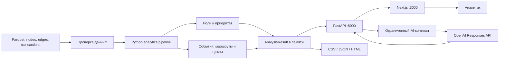

# «Граф денег» — AItushka

Инструмент для исследования сети банковских переводов. Он помогает аналитику найти клиентов с приоритетом проверки, понять их роль в наблюдаемой сети, увидеть маршруты и временные паттерны переводов и получить объяснение каждого вывода на основе исходных операций.

Проект создан для аналитиков финансового мониторинга и жюри хакатона. Решение не выносит юридических решений и не объявляет клиента нарушителем: оно формирует проверяемые гипотезы и сокращает путь от большого графа операций до конкретных оснований для дальнейшего анализа.

## Что реализовано

- загрузка и строгая проверка трёх Parquet-таблиц: клиентов, агрегированных связей и операций;
- построение направленного графа переводов с сохранением точности больших `int64`-идентификаторов;
- выделение сообществ алгоритмом Louvain;
- шесть объяснимых гипотез ролей: `consolidator`, `distributor`, `transit`, `terminal`, `coordinator`, `peripheral`;
- приоритет проверки от 0 до 1 с расшифровкой вклада каждого признака;
- поиск временных событий: всплесков, групповых поступлений, повторов состава и последующих выходов;
- поиск повторяющихся маршрутов и циклов с учётом дат и неизвестного порядка операций внутри дня;
- интерактивный кабинет аналитика: обзор, очередь клиентов, фильтры, карточка клиента, граф связей и выгрузки;
- переход от события к его участникам и исходным операциям;
- автономная HTML-справка клиента и JSON-пакет доказательств;
- AI-помощник: объяснение клиента или события, вопросы по текущему контексту и TXT-черновик заключения со ссылками F1, F2… на основания;
- обязательные CSV-выгрузки и метаданные воспроизводимого запуска;
- production-контейнер, Docker Compose и GitHub Actions для тестирования и публикации образа.

## Подтверждённый результат на данных хакатона

| Показатель | Значение |
|---|---:|
| Клиентов | 2 248 |
| Направленных связей | 3 119 |
| Операций | 4 840 |
| Период | 01.07.2026–31.07.2026 |
| Сообществ | 88 |
| Найденных событий | 974 |
| Клиентов хотя бы с одним событием | 1 177 |

Найденные события включают 133 всплеска, 66 групповых поступлений, 5 повторов состава, 297 последующих выходов, 86 повторяющихся маршрутов и 387 циклов. Это совпадения формализованных правил, а не количество подтверждённых нарушений.

## Как работает решение

1. Backend читает `nodes.parquet`, `edges.parquet` и `transactions.parquet`, проверяет схему, ссылки на клиентов и совпадение агрегатов с операциями.
2. Python-пайплайн строит направленный граф, вычисляет признаки, сообщества, гипотезы ролей и приоритет проверки.
3. Отдельные модули анализируют дневные потоки, маршруты и циклы. Каждое событие хранит правило, даты, измерения и ссылки на исходные операции.
4. FastAPI держит текущий `AnalysisResult` в памяти и отдаёт типизированные данные, граф, справки и CSV.
5. Next.js показывает аналитику очередь клиентов. Из карточки можно перейти к основаниям, событию, контрагенту или графу.
6. По явному нажатию AI-помощник получает ограниченный пакет уже рассчитанных фактов. Идентификаторы участников заменяются локальными псевдонимами. Ответ проходит проверку структуры и ссылок на источники.
7. Аналитик скачивает обычную справку или AI-черновик и принимает решение о следующей проверке самостоятельно.

## Технологии

| Слой | Используется |
|---|---|
| Аналитика | Python 3.12, pandas, NumPy, SciPy, NetworkX, PyArrow |
| API | FastAPI, Uvicorn, Pydantic, HTTPX |
| Frontend | Next.js 16, React 19, TypeScript |
| Граф | NetworkX, PyVis, Louvain communities |
| AI | OpenAI Responses API, Structured Outputs, модель по умолчанию `gpt-5.4-mini` |
| Данные | Parquet, CSV, JSON |
| Поставка | Docker, Docker Compose, GitHub Actions, GHCR |
| Проверка | pytest, TypeScript compiler, Next.js production build, container smoke-test |

AI не рассчитывает роли, суммы или рейтинг. Все фактические показатели вычисляет Python; модель только помогает интерпретировать выбранный контекст.

## Архитектура



Основные компоненты:

- `src/money_graph/` — проверка данных, признаки, роли, рейтинг, события, отчёты и API;
- `frontend/` — отдельный интерфейс Next.js;
- `run.py` — единая локальная команда расчёта и запуска двух серверов;
- `data/` — исходные данные хакатона;
- `tests/` — автоматические проверки аналитики и HTTP-контрактов;
- `Dockerfile`, `compose.yaml`, `deploy/` — production-запуск;
- `.github/workflows/ci-cd.yml` — CI и доставка контейнера.

Подробная схема и инварианты модулей находятся в [docs/architecture.md](docs/architecture.md).

## Установка и локальный запуск

Требования: Python 3.12, Node.js 24 и npm.

### Windows PowerShell

```powershell
git clone https://github.com/BAITC-Hacks/hack-912ce0e6-aitushka.git
cd hack-912ce0e6-aitushka
py -3.12 -m venv .venv
.\.venv\Scripts\python.exe -m pip install -r requirements.txt
npm install --prefix frontend
.\.venv\Scripts\python.exe run.py --data data --out outputs --ui
```

### Linux / macOS

```bash
git clone https://github.com/BAITC-Hacks/hack-912ce0e6-aitushka.git
cd hack-912ce0e6-aitushka
python3.12 -m venv .venv
.venv/bin/python -m pip install -r requirements.txt
npm install --prefix frontend
.venv/bin/python run.py --data data --out outputs --ui
```

После сообщения о готовности откройте [http://localhost:3000](http://localhost:3000). `Ctrl+C` останавливает оба сервера. Для расчёта без интерфейса уберите `--ui`.

Другие порты и конфигурация:

```powershell
.\.venv\Scripts\python.exe run.py --data data --out outputs --config config.json --ui --port 3000 --api-port 8000
```

## Запуск через Docker

Сборка и запуск из репозитория:

```bash
cp .env.example .env
docker compose up -d --build
docker compose ps
```

Приложение доступно на `http://localhost:3000`. Контейнер запускается без root, публикует только порт `3000` и проверяет полный путь `Next.js → FastAPI → анализ` через `/api/health`.

После успешного CI готовый образ публикуется как:

```text
ghcr.io/baitc-hacks/hack-912ce0e6-aitushka:latest
```

Тогда вместо локальной сборки можно выполнить:

```bash
docker compose pull
docker compose up -d --no-build
```

## Запуск в NVIDIA Brev / DGX Cloud

Приложение не использует CUDA, поэтому для демонстрации достаточно CPU-инстанса. На Brev:

```bash
git clone https://github.com/BAITC-Hacks/hack-912ce0e6-aitushka.git
cd hack-912ce0e6-aitushka
cp .env.example .env
docker compose up -d --build
```

Для приватного доступа выполните на своём компьютере:

```bash
brev port-forward ИМЯ_ИНСТАНСА --port 3000:3000
```

Для демонстрации добавьте порт `3000` в Brev Console → Access → Using Tunnels. Полученный HTTPS URL укажите в `.env` как `AI_ALLOWED_ORIGINS=https://ваш-домен` и повторно выполните `docker compose up -d`.

Полная инструкция, обновление и откат: [docs/DEPLOY_NVIDIA.md](docs/DEPLOY_NVIDIA.md).

## Настройка AI

AI необязателен: вся основная аналитика работает без API-ключа и интернета. Для включения скопируйте `.env.example` в `.env` и заполните:

```dotenv
OPENAI_API_KEY=YOUR_KEY
OPENAI_MODEL=gpt-5.4-mini
AI_MAX_REQUESTS=50
# Для публичного размещения:
AI_ALLOWED_ORIGINS=https://ваш-домен
```

Ключ читает только backend, он не попадает во frontend и исключён из Git и Docker build context. Запрос создаётся только после действия пользователя. В OpenAI передаются выбранные показатели, даты, события и вопрос; исходные `gid` заменяются обозначениями участников. Используется `store: false`, но псевдонимизация не равна полной анонимизации.

Подробности: [docs/AI.md](docs/AI.md).

## Как жюри проверить решение

1. Запустите проект локально или через Docker и откройте обзор.
2. В строке поиска введите `100000003684369100`.
3. Убедитесь, что карточка показывает гипотезу «Координатор», приоритет `0,965`, входящий поток `3 848 436 KZT` и исходящий `8 588 655 KZT`.
4. Посмотрите «Основания приоритета»: достижимость от 9 seed, наблюдаемый поток, посредничество и число плательщиков показаны отдельно.
5. Откройте «События и маршруты», раскройте повторяющийся маршрут и проверьте его даты, шаги и исходные операции.
6. Нажмите «Показать на графе» и убедитесь, что граф ограничился участниками выбранного события.
7. Скачайте HTML-справку клиента или один из CSV в разделе «Выгрузки».
8. Если настроен OpenAI, нажмите «Объяснить клиента», затем откройте основание F3: суммы в ответе должны совпадать с локальными показателями.

Полный пятиминутный сценарий: [docs/DEMO.md](docs/DEMO.md).

## Выходные файлы

| Файл | Назначение |
|---|---|
| `nodes_roles.csv` | роль, сила признаков, сообщество, приоритет и объяснение каждого клиента |
| `clusters.csv` | размер, внутренний оборот, seed и основные клиенты сообщества |
| `top_nodes.csv` | верхняя очередь проверки |
| `run_metadata.json` | конфигурация, контрольные суммы, статистика и время расчёта |

Идентификаторы во всех JSON передаются строками. Сохранённые файлы в `outputs/` не используются API как кеш: HTTP-выгрузки формируются из текущего расчёта в памяти.

## Данные и интеграции

Исходные файлы находятся в `data/`:

- `nodes.parquet` — клиенты, seed и глубина обхода;
- `edges.parquet` — агрегаты направленных пар;
- `transactions.parquet` — отдельные переводы с датами и суммами.

Набор ограничен одним банком, июлем 2026 года, переводами от 5 000 KZT и обходом исходящих связей от 81 seed-клиента до глубины 4. Поля описаны в [data/README.md](data/README.md).

Единственная внешняя runtime-интеграция — OpenAI Responses API, и она включается только при наличии ключа. NVIDIA Brev используется как площадка запуска контейнера; специфические NVIDIA API и GPU в вычислениях проекта не используются.

## Автоматические проверки

```powershell
.\.venv\Scripts\python.exe -m pytest -q
npm.cmd run typecheck --prefix frontend
npm.cmd run build --prefix frontend
```

Локально подтверждено: `148 passed`, успешные TypeScript-проверка и production-сборка Next.js. GitHub Actions дополнительно собирает контейнер, запускает его, ждёт `/api/health`, проверяет UID `10001` и только затем публикует образ в GHCR.

## Ограничения текущей версии

- Это аналитические гипотезы без размеченной выборки нарушений; precision/recall не заявляются.
- В данных нет времени внутри дня, назначения платежа, баланса, внешних переводов и полной истории до/после периода.
- Seed-клиенты имеют неполную входящую часть, а узлы на глубине 4 могут иметь обрезанные исходящие связи.
- FIFO показывает совместимость дневных сумм, но не доказывает движение одних и тех же денег.
- Разные события могут ссылаться на одни операции; их суммы нельзя складывать в общий «подозрительный оборот».
- NetworkX-реализация рассчитана на текущий хакатонный набор и не заявлена как решение для миллиона узлов.
- AI может ошибиться в интерпретации даже при корректной ссылке на источник; финальный вывод проверяет аналитик.
- Лимиты AI и кеш находятся в памяти одного процесса и сбрасываются при перезапуске.
- В production-версии нет пользовательской аутентификации и общей системы ролей доступа; публичный URL следует защищать средствами платформы.

## Deployed-версия

Постоянной публичной deployed-версии сейчас нет. Репозиторий содержит готовые Docker/Compose-конфигурации для NVIDIA Brev/DGX Cloud и workflow публикации GHCR-образа. После появления стабильного публичного URL его следует добавить в этот раздел.

## Документация

- [Архитектура](docs/architecture.md)
- [Методика, формулы и пороги](docs/METHODOLOGY.md)
- [Проверка результатов](docs/VALIDATION.md)
- [Сценарий демонстрации](docs/DEMO.md)
- [AI-помощник](docs/AI.md)
- [Развёртывание в NVIDIA](docs/DEPLOY_NVIDIA.md)
