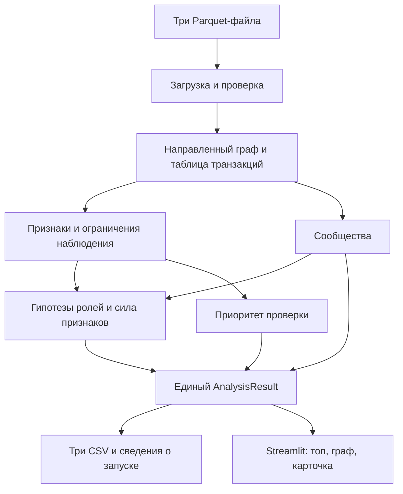

# «Граф денег»: сценарий, архитектура и план реализации

Исходный проектный план от 23 сентября 2026 года. Реализация завершена; фактические команды запуска, результаты и ограничения описаны в `../README.md`, методика — в `METHODOLOGY.md`, проверка — в `VALIDATION.md`. Ниже сохранён первоначальный roadmap.
План рассчитан на 5 часов работы команды из 3–4 человек. Время — ориентир, а готовность определяется проверками на каждом этапе.

## 1. Исходная точка и результат

В репозитории пока только README команды. Рядом с ним находятся ТЗ в PDF, описание датасета, `data (1).zip` и `starter (1).zip`. Стартер уже умеет загружать таблицы, строить граф, считать базовые признаки и создавать незаполненные шаблоны CSV.

По материалам организаторов: 2 248 клиентов, 3 119 направленных связей, 4 840 транзакций, 81 seed-клиент, июль 2026 года. Эти количества пока взяты из документации; содержимое Parquet нужно проверить на первом этапе.

Цель продукта: аналитик открывает приложение, видит приоритетных клиентов, находит произвольный `gid`, изучает связи и получает объяснение гипотезы о роли с конкретными числами.

Обязательный результат: три заполненные выгрузки, экран графа с поиском, документированные правила, полный пересчёт за ≤ 5 минут, инструкция запуска и пятиминутное демо. README и воспроизводимость дают 25 из 100 баллов по ТЗ, поэтому документируем решение с первого часа.

## 2. Сценарий работы аналитика

1. **Открыть набор данных.** Для MVP приложение читает стандартную папку `data/`. Показывает период, количество узлов и операций, ограничения выборки. Загрузка произвольного архива через браузер не входит в критический путь.
2. **Выполнить анализ.** Нажать «Пересчитать». Тот же расчёт можно запустить из терминала. После успеха приложение показывает время выполнения и готовые результаты.
3. **Выбрать приоритет.** Открыть топ-20, увидеть роль, приоритет и две-три числовые причины позиции. Фильтровать по роли, сообществу, seed и границе наблюдения.
4. **Исследовать клиента.** Ввести любой `gid`, открыть карточку и его входящие/исходящие связи. Поиск должен работать и для клиента без рёбер, и для клиента вне текущего фильтра.
5. **Проследить маршрут.** Посмотреть окружение на один переход, затем расширить до двух. Направление стрелок и суммы сохраняются. У длинных цепочек объяснять, что графовая достижимость сама по себе не доказывает движение одних и тех же денег.
6. **Понять ограничение.** Например: «Граница выгрузки: дальнейшие переводы неизвестны». Аналитик видит, какой дополнительный срез нужен для проверки.
7. **Скачать результат.** Получить все три CSV из того же расчёта, который показан на экране.

Пример формата объяснения, числа условные: «Получает от 11 клиентов, 8,4 млн KZT; наблюдаемые исходящие — 3% входящих. Признаки консолидации». Фактические числа всегда подставляются из рассчитанных метрик.

## 3. Архитектурное решение

Выбираем модульное локальное Python-приложение. Расчётное ядро работает независимо от интерфейса. CLI и Streamlit вызывают одну функцию `run_analysis(data_dir, config)`, возвращающую единый `AnalysisResult`.



| Слой | Технология / решение | Назначение |
|---|---|---|
| Чтение данных | pandas + pyarrow | Parquet, агрегаты, проверки |
| Граф | NetworkX | Направленные связи, PageRank, посредничество, сообщества |
| Численные зависимости | NumPy, SciPy | Вычисления и зависимости используемых графовых алгоритмов |
| Правила | Обычные Python-функции + `config.json` | Прозрачные пороги и веса |
| Интерфейс | Streamlit | Таблицы, фильтры, карточка, скачивание результатов |
| Граф в браузере | PyVis, ресурсы поставляются локально | Стрелки, цвет ролей/сообществ, масштабирование, подсказки |
| Хранение | Parquet + CSV + JSON | Данные, результаты и параметры расчёта |

Для этого объёма достаточно файлов и одного локального процесса приложения. База данных, отдельный API-сервер, авторизация и очередь задач не входят в MVP. Облачные сервисы и GPU для расчёта не нужны.

Фильтры интерфейса работают с готовыми результатами. Изменение поиска не должно запускать весь пайплайн заново. Ключ кеша включает содержимое входных файлов, конфигурацию и версию логики; подход к кешированию соответствует [документации Streamlit](https://docs.streamlit.io/develop/concepts/architecture/caching).

Браузерный граф для MVP получает выбранный `gid` из Streamlit. Клик внутри графа показывает подсказку; двустороннюю синхронизацию событий с Python можно добавить позже. Это снижает риск интеграции стороннего компонента.

## 4. Аналитическое ядро

### 4.1. Загрузка и контроль данных

- Проверить обязательные столбцы, типы, уникальность `gid` и пар рёбер, даты, конечность и допустимость сумм.
- Сверить `edges` с группировкой `transactions` по паре: совпадают пары, суммы с заданным денежным допуском и количество операций. Проверки только наличия пар, как в стартере, недостаточно.
- Добавить в граф сначала все `nodes`, затем рёбра. Так клиенты без связей сохраняются в анализе и выгрузках.
- Проверить, что концы каждого ребра есть в `nodes`. Не удалять автоматически одинаковые строки транзакций: без ID операции одинаковые записи могут отражать разные реальные переводы.
- Зафиксировать статистику, контрольные суммы файлов и время запуска. Некорректная схема останавливает расчёт с понятной ошибкой.

### 4.2. Набор признаков MVP

| Группа | Признаки | Что объясняют |
|---|---|---|
| Контрагенты | `in_deg`, `out_deg` | Сбор от нескольких клиентов и веерная рассылка |
| Наблюдаемые потоки | `in_kzt`, `out_kzt`, `in_tx`, `out_tx` | Масштаб и частота операций |
| Соотношение потоков | `pass_through = out_kzt / in_kzt` | Сопоставимость входа и выхода внутри выборки |
| Структура | PageRank, betweenness | Положение узла и посредничество на маршрутах |
| Связь с seed | Число различных seed, от которых узел достижим | Схождение нескольких наблюдаемых цепочек |
| Сообщества | `cluster_id`, число соседних сообществ | Связи внутри групп и между ними |
| Наблюдаемость | `is_seed`, `depth`, `truncated_by_depth`, отсутствие входа | Какие выводы ограничены выгрузкой |

При нулевом входе отношение потоков неопределённо; сохраняем `null` в техническом поле, а не бесконечность. Все обязательные поля итогового CSV при этом заполнены.

У seed и у узлов с исходящими выше входящих отношение не интерпретируется как доля «полученных и переданных тех же денег». Даже для остальных узлов это показатель только наблюдаемой выборки.

Betweenness для MVP считаем на направленном графе по числу переходов. Если полный расчёт занимает слишком много времени, используем выборку исходных узлов с фиксированным seed. Денежную сумму нельзя без обоснования подставлять как длину: в [NetworkX веса кратчайшего пути означают расстояние](https://networkx.org/documentation/stable/reference/algorithms/generated/networkx.algorithms.centrality.betweenness_centrality.html).

### 4.3. Сообщества

Для первого решения используем Louvain на явно построенной неориентированной проекции. Вес связи A—B равен сумме наблюдаемых переводов A→B и B→A. Направленный оригинал сохраняется для всех потоковых метрик и интерфейса.

Изолированные узлы получают отдельные сообщества. Фиксируем порядок входных узлов, random seed и версию зависимостей; номера сообществ назначаем детерминированно. Параметры `weight`, `resolution` и `seed` предусмотрены в [NetworkX Louvain](https://networkx.org/documentation/stable/reference/algorithms/generated/networkx.algorithms.community.louvain.louvain_communities.html).

Для каждого сообщества считаем размер, количество seed, внутренний оборот по исходным направленным рёбрам, главные узлы и объяснимую гипотезу. Например: «Несколько цепочек сходятся к двум узлам с большим числом плательщиков». Сообщество — структурная группа, а не доказанная преступная организация. Не подгоняем алгоритм под упомянутое организаторами число сообществ.

### 4.4. Роли

Пороговые значения ниже — стартовые гипотезы для реализации. После исследования распределений проверяем их на примерах, фиксируем в конфигурации и документируем. Они пока не валидированы на Parquet.

| Роль | Первое правило-кандидат | Существенная оговорка |
|---|---|---|
| `consolidator` | От ≥ 3 плательщиков, сходятся несколько seed-цепочек; небольшой наблюдаемый выход усиливает роль | На depth=4 вывод допустим по схождению входов, но удержание денег неизвестно |
| `distributor` | ≥ 10 получателей; число получателей существенно больше числа плательщиков | Большой веер — описание структуры, не доказательство нарушения |
| `transit` | Есть вход и выход, отношение около 0,8–1,2; seed и обрезанные узлы исключены из этого простого правила | Даты могут усилить гипотезу; месячное соотношение не доказывает транзит |
| `terminal` | Есть вход, нет наблюдаемого выхода, depth < 4, узел не seed | Только кандидат в конечные получатели в рамках периода и банка |
| `coordinator` | Высокое положительное посредничество, связи с несколькими сообществами, схождение ≥ 2 seed-цепочек | Интерпретация — структурный связующий узел, гипотеза о координации |
| `peripheral` | Нет достаточно выраженных признаков остальных ролей | Включает недостаток данных; не означает «безопасен» |

Считаем оценки нескольких допустимых ролей. Выбираем основную по максимальному скору; порядок разрешения равенств фиксируем в конфигурации. В карточке сохраняем альтернативную роль и причины неоднозначности.

Не нужно искусственно добиваться присутствия всех ролей в результатах. Нужно реализовать и объяснить правила словаря и корректно обработать каждый узел.

`role_score` в диапазоне [0, 1] — эвристическая сила свидетельств с учётом применимости правила. Это не калиброванная вероятность: правильной разметки нет. Отдельное поле `observation_note` описывает ограничение выборки. Для изолята допустимо `peripheral`, низкий скор и «Нет связей в предоставленной выборке».

### 4.5. Приоритет проверки

Первоначальная формула для обсуждения и проверки:

```text
priority_score = 0.35 × seed_convergence
               + 0.25 × observed_flow
               + 0.25 × brokerage
               + 0.15 × fan_in
```

Здесь `seed_convergence` — число seed, достижимых вверх по направленным связям; `observed_flow` — max(вход, выход); `brokerage` — betweenness; `fan_in` — число плательщиков. Собственный seed не засчитывается в схождение цепочек.

Каждый признак преобразуем в [0, 1] через заранее описанную нормализацию с сохранением нулей. Простой вариант: `min(x / Q95_positive, 1)`; если положительных значений нет — 0. Веса и квантили сохраняем вместе с результатами. Итог остаётся в диапазоне [0, 1], как требует ТЗ.

Формула выражает выбранную цель: найти точки схождения и значимых посредников. На проверке сравниваем её топ с крупнейшими распределителями, чтобы понять, не упускает ли ранжирование важные исходящие хабы. Проверяем вклад коррелирующих признаков.

Приоритет не равен силе роли и не умножается автоматически на `role_score`. Большой узел на границе графа может требовать первоочередной проверки именно из-за нехватки данных. В объяснении приоритета показываем два главных вклада и исходные числа.

## 5. Контракты результатов и интерфейс

`AnalysisResult` содержит таблицы узлов, сообществ и топа, граф, исходные транзакции и сведения о расчёте. `export.py` отвечает за формат, `app.py` — за показ. UI не дублирует формулы ролей и рейтинга.

| Файл | Обязательные поля |
|---|---|
| `nodes_roles.csv` | `gid`, `role`, `role_score`, `cluster_id`, `priority_score`, `evidence` |
| `clusters.csv` | `cluster_id`, `n_nodes`, `n_seed`, `sum_kzt_internal`, `top_gids`, `hypothesis` |
| `top_nodes.csv` | `rank`, `gid`, `role`, `priority_score`, `why` |

`evidence` — непустой текст до 200 символов с числами. У каждой строки есть кластер. Топ содержит ≥ 20 уникальных узлов, отсортирован по убыванию приоритета; при равенстве используем `gid`. Дополнительные признаки допустимы, обязательные поля сохраняются.

Три экрана MVP:

- **Обзор:** параметры выборки, распределение ролей, топ-20, скачивание CSV.
- **Граф:** поиск по `gid`, фильтр сообщества, переключение цвета «роль/сообщество», стрелки, подсказки о суммах, легенда.
- **Карточка:** роль и её признаки, приоритет и его слагаемые, ограничения, соседи, операции клиента.

Полная сеть доступна отдельным режимом. По умолчанию показываем сообщество или окружение выбранного узла; для больших окружений явно указываем число скрытых узлов и даём раскрытие. Цвет — роль/кластер, обводка — seed, отдельная отметка — граница выборки. Метрики в карточке всегда рассчитаны на полном наборе данных, а не на видимом фрагменте.

Для браузерного графа передаём `gid` строками, чтобы большие int64 не потеряли точность в JavaScript. В выгрузках сохраняем целочисленный идентификатор. Ресурсы визуализации должны открываться без CDN; проверяем это с отключённым интернетом. Возможности направленных сетей и подсказок описаны в [документации PyVis](https://pyvis.readthedocs.io/en/latest/documentation.html).

## 6. Планируемая структура проекта

```text
hack-912ce0e6-aitushka/
  README.md
  requirements.txt           # проверенные версии зависимостей
  config.json                # правила, пороги, веса, random seed
  run.py                     # единый запуск расчёта и, опционально, UI
  app.py                     # Streamlit
  data/                      # три исходных Parquet
  src/money_graph/
    pipeline.py              # порядок этапов и AnalysisResult
    data.py                  # чтение и контроль данных
    features.py              # граф и признаки
    communities.py           # сообщества и агрегаты
    roles.py                 # правила и role_score
    ranking.py               # priority_score и его вклады
    explain.py               # evidence, why, гипотезы сообществ
    export.py                # контракты CSV
    visualization.py         # представление графа
  tests/                     # смысловые случаи и контракты выгрузок
  outputs/                   # CSV и run_metadata.json
  docs/
    IMPLEMENTATION_PLAN.md   # этот план
    architecture.md          # схема для демонстрации
```

Целевые команды после установки зафиксированных зависимостей:

```bash
python run.py --data data --out outputs
python run.py --data data --out outputs --ui
```

Это интерфейс, который предстоит реализовать, а не существующие команды. Первый запуск готовит все результаты, второй дополнительно открывает приложение. Установка окружения описывается отдельно; секреты и платные API для запуска не требуются.

## 7. Roadmap на пять часов

| Время | Аналитика и данные | Интерфейс и документация | Контрольная точка |
|---|---|---|---|
| 00:00–00:25 | Распаковать материалы, настроить окружение, проверить данные | Зафиксировать контракт, создать экраны и README запуска | Стартер запускается; состав данных понятен |
| 00:25–01:20 | Признаки, наблюдаемость, Louvain | Топ-таблица, поиск, загрузка результата; подключение графа | Каждый узел присутствует и получает cluster_id |
| 01:20–02:20 | Правила ролей, рейтинг, объяснения, экспорт | Карточка, фильтры, направленные связи, скачивание | Три валидных CSV и интерфейс на реальных результатах |
| 02:20–03:10 | Разбор топа и крайних случаев, исправление правил | Поиск произвольного gid, связность экранов, offline-ресурсы | Полный обязательный сценарий проходит от начала до конца |
| 03:10–03:50 | Одна дополнительная функция, только если MVP готов | Представление бонуса и подготовка демо | Бонус отключаем без поломки основного результата |
| 03:50–04:35 | Проверка контрактов, повторяемости, времени | Чистый запуск, финальный README, схема и примеры | Репозиторий можно воспроизвести по инструкции |
| 04:35–05:00 | Только исправления блокирующих ошибок | Репетиция пяти минут, контроль сдаваемых файлов | Готовая сдача и резерв времени |

Распределение на 4 человека: A — данные/метрики/сообщества; B — роли/приоритет/объяснения; C — интерфейс; D — интеграция/проверки/README/демо. При 3 участниках один берёт всю аналитику, второй — UI, третий — интеграцию, проверки и документацию. Разделение утверждаем по фактическим навыкам команды.

Критический путь: **валидные данные → признаки/сообщества → роли/рейтинг → CSV → интеграция → проверка сдачи**. UI можно разрабатывать параллельно по согласованному контракту. Если к 03:10 обязательный сценарий не готов, бонусный слот целиком отдаём его завершению.

Для одного разработчика это агрессивный график. Сохраняем то же ядро, сокращаем оформление UI и убираем бонусы; оценку общего времени пересматриваем после первого рабочего запуска.

## 8. Дополнительная функция и что отложить

Первый кандидат на бонус — временные признаки из `transactions`: повторяющиеся входы и выходы в пределах 1–2 дней и их показ в карточке. Обработка должна избегать многократного зачёта одной исходящей суммы против нескольких входящих.

В данных указана дата, а не точное время. Переводы в один день не дают достоверного порядка событий. Временное совпадение обозначаем как совместимость с гипотезой транзита, не как доказанное отслеживание конкретных денег. Если аккуратная реализация не укладывается в слот, вместо неё показываем дневные потоки без скоринга.

Следующий резервный бонус — изменение связности при удалении топ-N узлов с понятной метрикой до/после. Это модель структурной зависимости графа, а не прогноз реального прекращения деятельности.

LLM-чат, обучаемая модель, поиск всех циклов и отдельный React-фронтенд откладываются. В ТЗ AI-ассистент — опция; сначала сдаём объяснимую аналитику и рабочий сценарий.

## 9. Проверки готовности

1. **Данные:** количества соответствуют текущему набору; пары, суммы и число операций согласованы; все gid сохранены, в том числе изоляты.
2. **Выход:** ровно 2 248 строк для предоставленного набора; допустимые роли; заполненные обязательные поля; scores конечны и лежат в [0, 1]; evidence ≤ 200 символов; топ ≥ 20 и отсортирован.
3. **Смысловые случаи:** узел depth=4 без выхода не получает terminal из-за обрыва; seed без входа не становится транзитом из-за ошибочного отношения; изолят получает результат и карточку; все сообщества и суммы сходятся с узлами/рёбрами.
4. **Повторяемость:** одинаковые файлы и config дают те же роли, scores, кластеризацию и порядок строк при повторном запуске. Служебные время и timestamp сравниваем отдельно.
5. **Производительность:** замерять полный холодный расчёт, а не чтение кеша; ≤ 5 минут. Результат измерения записать в README.
6. **Объяснимость:** просмотреть топ-20, несколько представителей каждой получившейся роли, границу графа и seed; объяснить три произвольных gid меньше чем за минуту.
7. **Интерфейс:** поиск всех категорий узлов, направление связей, легенда, фильтры и скачивание работают без интернета после установки зависимостей.
8. **Сдача:** исходники, зависимости, README, три CSV, схема, ограничения и раздел о росте до миллиона узлов присутствуют.

Без размеченных ролей не заявляем accuracy/F1. Дополнительная проверка качества — изменение порогов на ±20% и сравнение состава топ-20; показываем фактическую устойчивость, а не обещаем её заранее.

## 10. Демо на пять минут

- **0:00–0:30:** проблема аналитика, размер выборки, итоговый вопрос «кого смотреть первым».
- **0:30–1:15:** запуск расчёта, отчёт о проверке данных, готовые три выгрузки. Фактический runtime заранее измерен.
- **1:15–2:15:** первый узел из топа: роль, две числовые причины, связанные seed и поток.
- **2:15–3:15:** второй пример другой роли; направление переводов и карточка.
- **3:15–4:00:** узел четвёртого уровня: почему не называем его доказанным конечным получателем; поиск произвольного gid.
- **4:00–4:30:** бонус, если готов, либо сообщество и его гипотеза.
- **4:30–5:00:** скачивание CSV, воспроизводимость, ограничения и следующий запрос данных.

## 11. Архитектура при росте до ~1 млн узлов

Это обязательное текстовое обоснование для README, а не задача реализации на хакатоне. При таком объёме меняем загрузку целиком в память на пакетные/колоночные агрегаты, графовые вычисления переносим на подходящий эффективный движок, посредничество оцениваем приближённо. В UI передаём только запрошенные подграфы и агрегаты сообществ. Потребность в БД, отдельном API и фоновых заданиях определяется числом рёбер, пользователей и частотой обновления. Контракт результатов и объяснимые правила остаются самостоятельными модулями.

## 12. Первое действие после утверждения направления

Перенести стартер и данные в структуру репозитория, настроить зависимости, выполнить полную проверку Parquet и исследовать распределения признаков. По результату зафиксировать первоначальные пороги и контракт AnalysisResult. Дальше вести аналитику и интерфейс параллельно до первого полного сценария.
