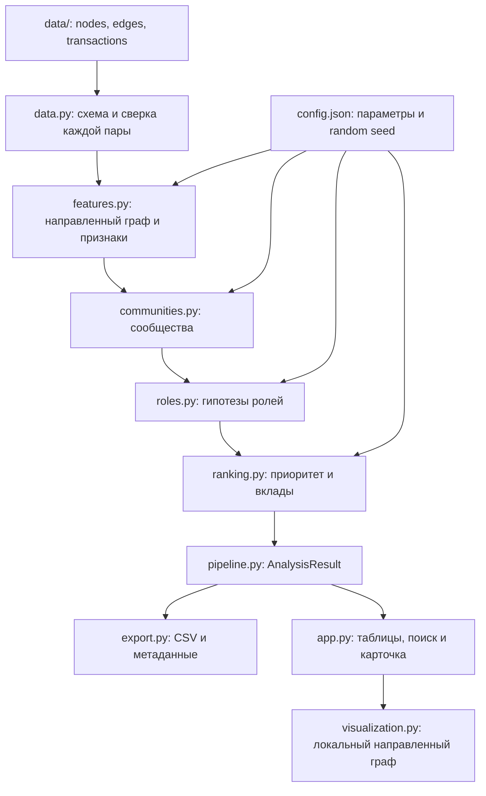

# Архитектура «Графа денег»

Локальный модульный Python-пайплайн превращает три Parquet-таблицы в единый `AnalysisResult`. CLI и Streamlit вызывают одно ядро; формулы не дублируются в интерфейсе. Приложение не требует облачного сервиса или отдельной базы данных.

## Ответственность модулей

| Модуль | Вход и результат | Инвариант |
|---|---|---|
| `data` | папка → `edges`, `nodes`, `transactions`; проверка → статистика | Обязательная схема, известные концы рёбер, согласованные суммы и число операций |
| `features` | таблицы → `DiGraph` и признаки узлов | Все `gid`, в том числе изоляты, сохраняются без преобразования в float |
| `temporal` | даты и суммы операций → совместимые потоки через 1–2 дня | FIFO не расходует вход/выход повторно; операции одного дня не устанавливают порядок |
| `communities` | граф → `cluster_id`; узлы и рёбра → агрегаты кластеров | Сообщество назначено каждому узлу; направление сохраняется в исходном графе |
| `roles` | признаки → роль, сила признаков, объяснение | Ограничения наблюдения учитываются до выбора роли |
| `ranking` | признаки и роли → приоритет, топ, шкалы нормализации | Сила роли не является множителем приоритета |
| `pipeline` | папка и конфигурация → `AnalysisResult` | Один порядок этапов для CLI и интерфейса |
| `export` | результат → CSV и JSON | Проверка обязательных полей, диапазонов и покрытия клиентов |
| `visualization` / `app` | результат и выбор аналитика → представление | Фильтры не изменяют рассчитанные метрики |

`AnalysisResult` включает `nodes`, `clusters`, `top_nodes`, `edges`, `transactions`, `graph`, `metadata`. `run.py` задаёт папки, конфигурацию, необходимость запуска UI и порт.

## Две проекции сети

Основной `DiGraph` содержит перевод A→B отдельно от B→A и используется для потоков, достижимости от seed, посредничества и показа стрелок. Для Louvain создаётся неориентированная проекция: вес A—B равен сумме наблюдаемых переводов в обе стороны. Возвращённые сообщества используются как дополнительный структурный признак; они не подменяют исходный граф.

Betweenness в MVP основана на количестве переходов и оценивается по 256 исходным узлам с фиксированным `random_seed=42`; на меньших графах рассчитывается полностью. Денежная сумма не используется как расстояние. Случайность алгоритмов фиксируется конфигурацией; идентификаторы сообществ и порядок равенств назначаются детерминированно.

## Поток результата в интерфейсе

Расчёт выполняется при открытии набора или явном пересчёте. Поиск `gid`, выбор цвета и фильтр сообщества работают с готовым результатом. Карточка всегда показывает метрики полной сети, даже если виден только один переход окружения. Изолят доступен для поиска и получает карточку.

Идентификаторы в браузерном графе передаются строками: JavaScript не может точно представить все значения `int64`. Локальные ресурсы графа позволяют работать без интернета после установки зависимостей. Направление ребра соответствует отправителю и получателю, а не порядку обхода визуализации.

## Проверяемые свойства

- Полная сверка `edges` с `transactions` по направленной паре: одна проверка глобального оборота не выявит перестановку сумм между парами.
- Сохранение клиентов без связей и соседних больших `gid`.
- Запрет простых гипотез `terminal`/`transit` для границы обхода и seed.
- Независимость приоритета от силы роли и отсутствия наблюдаемых исходящих за границей выгрузки.
- Повторяемость аналитических результатов при одинаковых входах и конфигурации.
- Один контракт CSV для скачивания и файлового экспорта.

## Переход к большому графу

При росте до миллиона узлов заменяется вычислительный слой: пакетное чтение и агрегации, эффективный графовый движок, приближённое посредничество, подграфы по запросу. Потребность в API, фоновых заданиях и постоянном хранилище определяется объёмом рёбер и частотой обновления. `AnalysisResult`, формулы ролей и объяснения остаются контрактом между вычислениями и интерфейсом; текущая реализация не выдаётся за готовую к такому масштабу.
