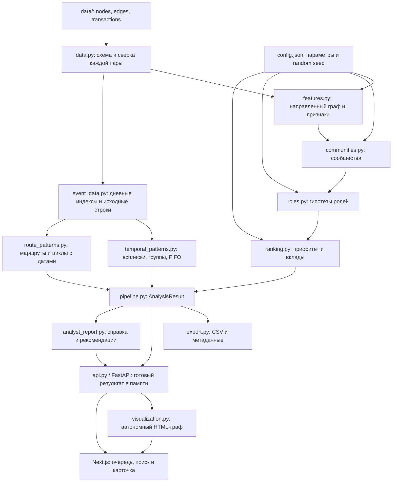

# Архитектура «Графа денег»

Локальный Python-пайплайн превращает три Parquet-таблицы в `AnalysisResult`. CLI и FastAPI вызывают одно аналитическое ядро; отдельный Next.js frontend получает данные через HTTP. Формулы не дублируются в браузере. Приложение не требует облачного сервиса или отдельной базы данных.

## Ответственность модулей

| Модуль | Вход и результат | Инвариант |
|---|---|---|
| `data` | папка → `edges`, `nodes`, `transactions`; проверка → статистика | Обязательная схема, известные концы рёбер, согласованные суммы и число операций |
| `features` | таблицы → `DiGraph` и признаки узлов | Все `gid`, в том числе изоляты, сохраняются без преобразования в float |
| `temporal` | даты и суммы операций → совместимые потоки через 1–2 дня | FIFO не расходует вход/выход повторно; операции одного дня не устанавливают порядок |
| `event_data` | операции → дневные пулы, дневные рёбра, стабильные ссылки на строки | Одинаковые строки сохраняются; gid остаются строками; самопереводы не создают паттерны |
| `temporal_patterns` | дневные индексы → всплески, группы, повторы состава, журнал FIFO | Базу сравнения можно проверить; недостаточная история сообщается явно |
| `route_patterns` | дневные рёбра и граф → маршруты, циклы и полнота поиска | Ограничены кандидаты и шаги перебора; порядок одного дня не считается известным |
| `analyst_report` | результат и gid → JSON / автономный HTML | Все числа из текущего расчёта; ограничения и сокращения раскрыты |
| `communities` | граф → `cluster_id`; узлы и рёбра → агрегаты кластеров | Сообщество назначено каждому узлу; направление сохраняется в исходном графе |
| `roles` | признаки → роль, сила признаков, объяснение | Ограничения наблюдения учитываются до выбора роли |
| `ranking` | признаки и роли → приоритет, топ, шкалы нормализации | Сила роли не является множителем приоритета |
| `pipeline` | папка и конфигурация → `AnalysisResult` | Один порядок этапов для CLI и API |
| `export` | результат → CSV и JSON | Проверка обязательных полей, диапазонов и покрытия клиентов |
| `api` | HTTP GET → JSON, CSV, HTML | Кеш по содержимому входов и конфигурации; идентификаторы в JSON — строки |
| `visualization` | результат и область графа → HTML | Локальные JS/CSS; выбранный клиент сохраняется при ограничении размера |
| `frontend/` | API-ответы и действия аналитика → экран | Отдельный Next.js frontend; фильтры не изменяют рассчитанные метрики |

`AnalysisResult` включает `nodes`, `clusters`, `top_nodes`, `edges`, `transactions`, `graph`, `metadata`, а также `patterns`, `pattern_status`, `pattern_coverage`, `event_index`. `run.py` задаёт папки, конфигурацию и порты, сохраняет CLI-выгрузки и при `--ui` управляет двумя серверными процессами. `run_metadata.json` включает количество событий, их типы и полноту поиска; индивидуальные справки выгружаются через API.

## Запуск и HTTP-контракт

`python run.py --ui` сначала выполняет аналитический CLI-расчёт. Затем запускает Uvicorn (`money_graph.api:app`, `127.0.0.1:8000`) и ждёт успешный `/api/health`. После готовности backend запускается Next.js (`127.0.0.1:3000`). `Ctrl+C`, ошибка запуска или завершение одного процесса приводят к остановке оставшихся дочерних процессов launcher.

Frontend отправляет запросы на относительные адреса `/api/...`; Next.js проксирует их на `API_BASE_URL`, который задаёт launcher. Это сохраняет один браузерный origin и позволяет менять backend-порт через `--api-port`. В Python передаются `MONEY_GRAPH_DATA`, `MONEY_GRAPH_OUT`, `MONEY_GRAPH_CONFIG`. Телеметрия Next.js отключена.

| Endpoint | Назначение |
|---|---|
| `GET /api/health` | Готовность анализа; ошибки исходных данных возвращают 503 |
| `GET /api/overview` | Сводка набора, роли, сообщества и метаданные |
| `GET /api/clients` | Отфильтрованная очередь, `limit`/`offset` и общее число клиентов |
| `GET /api/clients/{gid}` | Карточка, входящие/исходящие соседи, дневные потоки и операции |
| `GET /api/clients/{gid}/navigation` | Позиция и соседние клиенты во всей отфильтрованной очереди, независимо от загруженной страницы |
| `GET /api/clients/{gid}/patterns` | События с участием клиента, `kind`/`limit`/`offset`, статусы и покрытие поиска |
| `GET /api/patterns/{pattern_id}` | Событие, исходные операции, отдельные операции сравнительной базы всплеска |
| `GET /api/clients/{gid}/report?format=html\|json` | Краткая печатная HTML-справка или полный JSON с доказательствами |
| `GET /api/graph` | HTML-граф выбранного клиента, сообщества или текущего фильтра |
| `GET /api/exports/{filename}` | Выгрузки из текущего результата в памяти |

## Две проекции сети

Основной `DiGraph` содержит перевод A→B отдельно от B→A и используется для потоков, достижимости от seed, посредничества и показа стрелок. Для Louvain создаётся неориентированная проекция: вес A—B равен сумме наблюдаемых переводов в обе стороны. Возвращённые сообщества используются как дополнительный структурный признак; они не подменяют исходный граф.

Betweenness в MVP основана на количестве переходов и оценивается по 256 исходным узлам с фиксированным `random_seed=42`; на меньших графах рассчитывается полностью. Денежная сумма не используется как расстояние. Случайность алгоритмов фиксируется конфигурацией; идентификаторы сообществ и порядок равенств назначаются детерминированно.

## Поток результата в интерфейсе

При первом запросе backend строит свой результат и хранит его в памяти. Проверка контрольной суммы обнаруживает изменение входов и конфигурации; следующий запрос пересчитывает результат. Python-код также входит в fingerprint, но для загрузки изменённых функций backend требуется перезапустить. Начальное вычисление защищено блокировкой, поэтому параллельные HTTP-запросы не создают несколько одновременных расчётов. Некорректные обновлённые данные возвращают ошибку вместо прежнего результата.

Поиск `gid`, выбор цвета и фильтр сообщества работают с готовым результатом. Карточка всегда показывает метрики полной сети, даже если виден только один переход окружения. Изолят доступен для поиска и получает карточку. CSV для HTTP-скачивания строятся из текущего результата; сохранённые CLI-выгрузки не являются кешем API.

Идентификаторы в браузерном графе передаются строками: JavaScript не может точно представить все значения `int64`. Локальные ресурсы графа позволяют работать без интернета после установки зависимостей. Направление ребра соответствует отправителю и получателю, а не порядку обхода визуализации.
Кнопка карточки в графе передаёт строковый `gid` через `postMessage`. Next.js проверяет origin и окно-источник iframe перед переходом. При смене фильтров незавершённые запросы очереди отменяются; устаревшая страница не смешивается с новым срезом.

Слой событий вычисляется один раз вместе с результатом. `has_patterns=true` фильтрует очередь по участию в событиях. При раскрытии события, скачивании справки и переходе к графу frontend передаёт `fingerprint`; несовпадение возвращает HTTP 409 и предложение обновить данные. Граф с `pattern_id` содержит все узлы события и только доказательные рёбра. Их суммы относятся к операциям события; показатели узлов подписаны как суммы за период. Выбор события сохраняется в URL.

## Проверяемые свойства

- Полная сверка `edges` с `transactions` по направленной паре: одна проверка глобального оборота не выявит перестановку сумм между парами.
- Сохранение клиентов без связей и соседних больших `gid`.
- Запрет простых гипотез `terminal`/`transit` для границы обхода и seed.
- Независимость приоритета от силы роли и отсутствия наблюдаемых исходящих за границей выгрузки.
- Повторяемость аналитических результатов при одинаковых входах и конфигурации.
- Один контракт CSV для скачивания и файлового экспорта.

## Переход к большому графу

При росте до миллиона узлов заменяется вычислительный слой: пакетное чтение и агрегации, эффективный графовый движок, приближённое посредничество, подграфы по запросу. Потребность в API, фоновых заданиях и постоянном хранилище определяется объёмом рёбер и частотой обновления. `AnalysisResult`, формулы ролей и объяснения остаются контрактом между вычислениями и интерфейсом; текущая реализация не выдаётся за готовую к такому масштабу.
